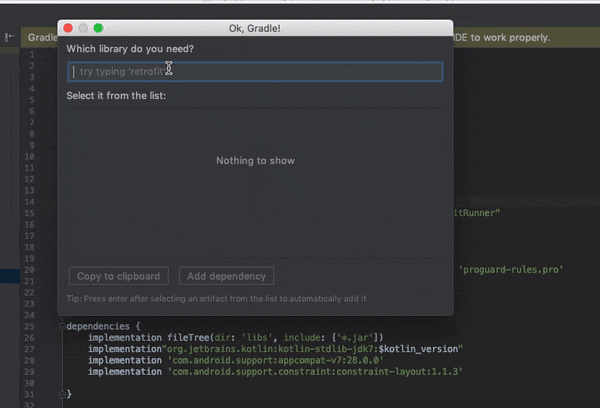

**This plugin is still in alpha stage, so it might be unstable. Feel free to share your feedback and report issues!**

# OK, Gradle!


IntelliJ/Android Studio Plugin for searching artifacts ids of popular Java libraries.

Use those for adding new dependencies easily to your build.gradle files.

#### Retrofit - which one was it?
```
compile 'com.square.retrofit:retrofit2:2.3.0'
compile 'com.squareup.retrofit2:retrofit:2.3.0'
```

#### Android Design library - which one was it?
```
compile 'com.android.support:design:26.1.0'
compile 'com.android.support:support-design:26.1.0'
```

With this plugin, you won't have to remember it anymore nor open an external browser to search for it on the Internet.

Usage:

Find the **OK, Gradle** action  with `CTRL/CMD+SHIFT+A` shortcut and type library's name that you are looking for in an input field.

To make your life even more easier, assign a shortcut to it. Personally, I prefer `CMD+K` - as in **"OK!"** (I don't use commit action in the IDE anyway).

You need to have an active Internet connection to be able to use this tool.

## Disclaimer
I want to thank <a href="https://chrisbroadfoot.id.au">Chris Broadfoot</a> for creating <a href="http://gradleplease.appspot.com">http://gradleplease.appspot.com</a> website, which was an inspiration for this plugin.

## License
```
Copyright 2017 Marcin Robaczyński

Licensed under the Apache License, Version 2.0 (the "License");
you may not use this file except in compliance with the License.
You may obtain a copy of the License at

   http://www.apache.org/licenses/LICENSE-2.0

Unless required by applicable law or agreed to in writing, software
distributed under the License is distributed on an "AS IS" BASIS,
WITHOUT WARRANTIES OR CONDITIONS OF ANY KIND, either express or implied.
See the License for the specific language governing permissions and
limitations under the License.
```